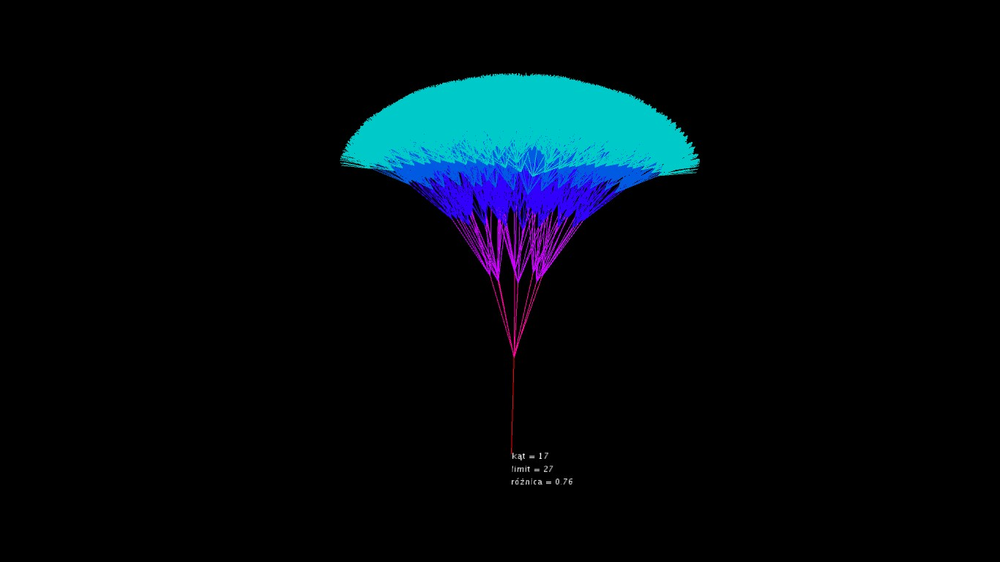
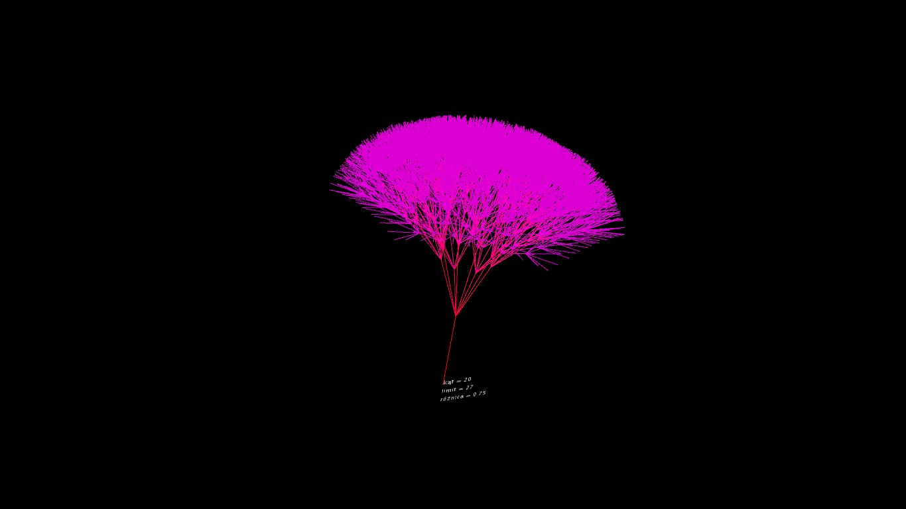
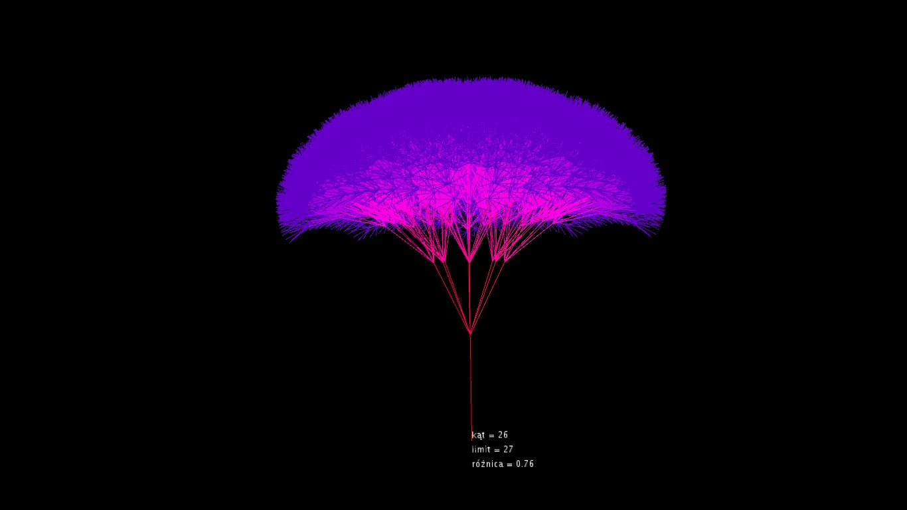
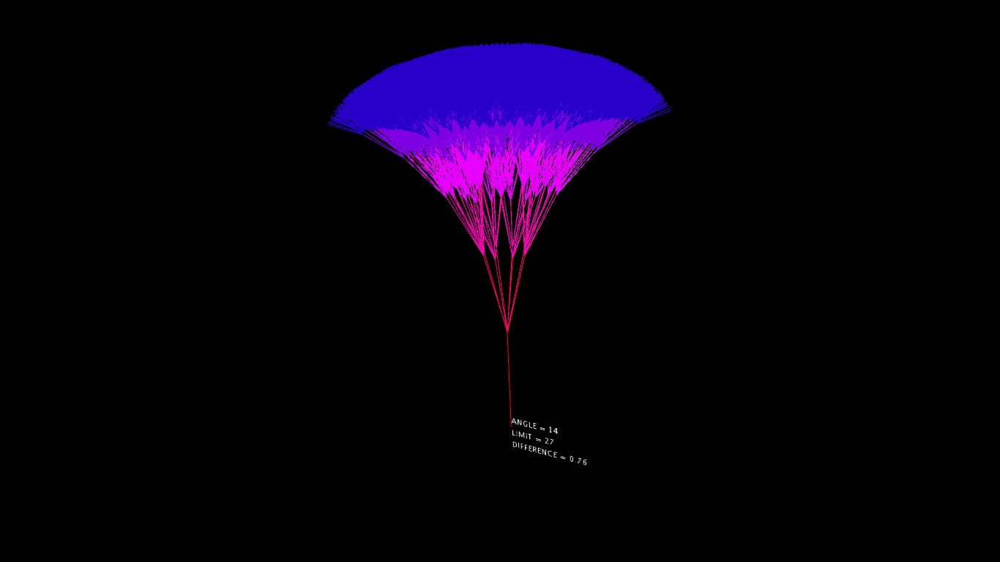
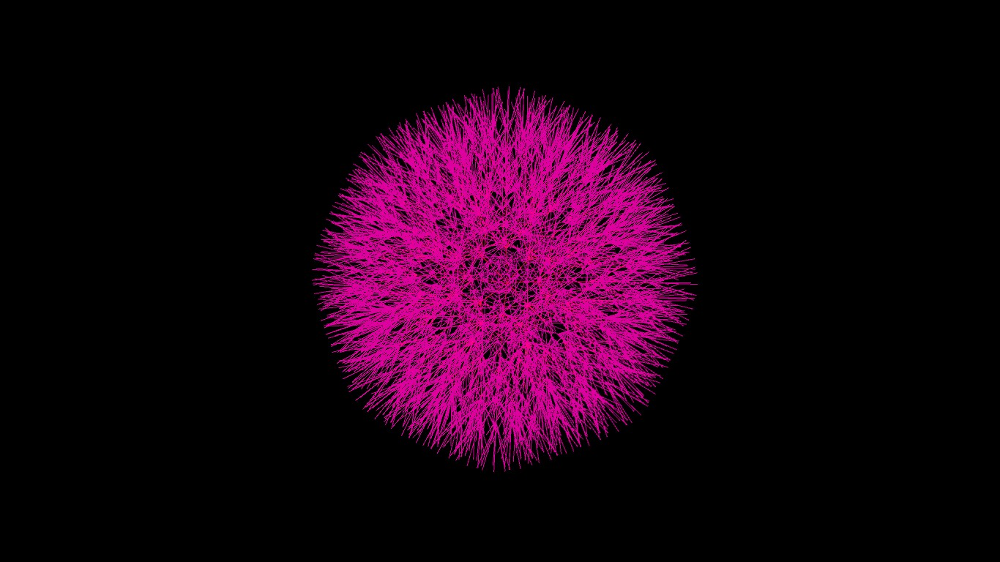

# Fractal_tree
Program napisany w Javie w środowisku graficznym Processing.  
Aby go skompilować wymagane jest środowisko z biblioteką peasyCam  
(dostępna do pobrania z poziomu środowiska).  
  
Ideą programu jest przeniesienie popularnych drzew fraktalnych  
do przestrzeni 3D. Zamiast dwóch, z każdego rozgałęźenia wychodzi  
8 gałęzi (cztery zgodnie z względnymi dla rodzica płaszczyznami  
X i Y, i cztery po jego ukosach).  
Program działa rekurencjnie.  
  
Przykłady drzew:
  
  
  
  
  
